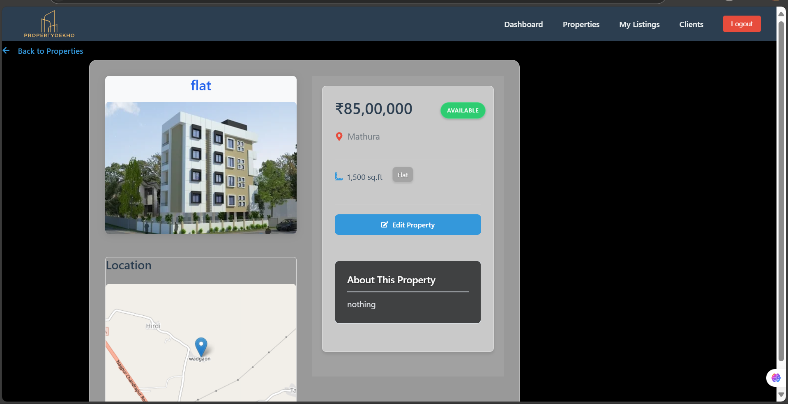

# PropertyDekho

PropertyDekho is a modern, full-stack property management platform designed to simplify real estate operations for agents and clients. The platform allows users to manage property listings, client information, and meetings, with a beautiful and intuitive interface.

## Features

- 🏠 **Property Listings**: Browse, search, filter, and view detailed property information.
- ➕ **Add/Edit Properties**: Agents can add new properties, edit details, and upload images.
- 👤 **Client Management**: Manage client details, preferences, and budgets.
- 📅 **Meetings**: Schedule and track meetings with clients.
- 🔒 **Authentication**: Secure login and signup for agents and clients.
- 📊 **Dashboard**: Quick overview of properties, clients, and recent activity.

## Screenshots

### Dashboard


### Client Management


### My Listings


### Edit Property


### View Property


## Getting Started

### Prerequisites
- Node.js and npm
- MongoDB (for backend)

### Installation

1. Clone the repository:
   ```bash
   git clone https://github.com/Radhikasha/propertyDekho.git
   cd propertyDekho
   ```
2. Install dependencies for both frontend and backend:
   ```bash
   cd backend
   npm install
   cd ../frontend
   npm install
   ```
3. Start the backend server:
   ```bash
   npm start
   ```
4. Start the frontend React app:
   ```bash
   npm start
   ```

The frontend will run on [http://localhost:3000](http://localhost:3000) and the backend on [http://localhost:5000](http://localhost:5000) by default.

## Folder Structure

```
propertyDekho/
  backend/      # Node.js/Express backend
  frontend/     # React frontend
```

## Contributing
Pull requests are welcome! For major changes, please open an issue first to discuss what you would like to change.

## License
[MIT](LICENSE)
